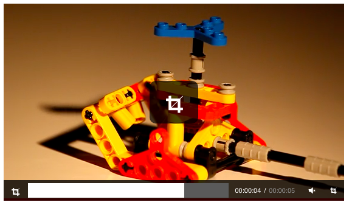

# react-html5-video-editor

React / redux video element with a crop marker. Crop markers emit Redux actions when dragged.

[](https://www.npmjs.com/package/react-html5-video-editor)
[](https://travis-ci.org/evgenity/react-html5-video-editor)
[](https://david-dm.org/evgenity/react-html5-video-editor)


<!--[demo](https://github.com/)-->

## Features:
 - simple & clean
 - video crop
 - effect composer
 - numerous formats support
 - customizable
 
Do not hesitate to post an issue to request a feature (seriously).

## Roadmap
 - enhanced video previews
 - effect composer
 - multiple tracks

## Quickstart
### Install
```
npm init
npm install react-html5-video-editor --save
ls node_modules/react-html5-video-editor/dist/bundle.js
```

### Basic usage
```html
<body>
    <div id="root"></div>
    <script type="text/javascript" src="js/bundle.js"></script>
 </body>
```

```javascript
import {RdxVideo, Overlay, Controls} from 'react-html5-video-editor'
ReactDOM.render(
  <RdxVideo autoPlay loop muted poster="src/img/poster.png" store={store}>
    <Overlay />
    <Controls />
    <source src="src/video/small.mp4" type="video/mp4" />
  </RdxVideo>
  ,
  document.getElementById('root')
);
```

### Configuration
```javascript
RdxVideo.Props = {
	autoPlay: false,
	loop: false,
	controls: true,
	volume:	1.0,
	preload: "auto",
	cropEnabled: true;
}
```

## License
Code released under [GNU GPLv3](https://github.com/evgenity/react-html5-video-editor/blob/master/LICENSE.txt)
